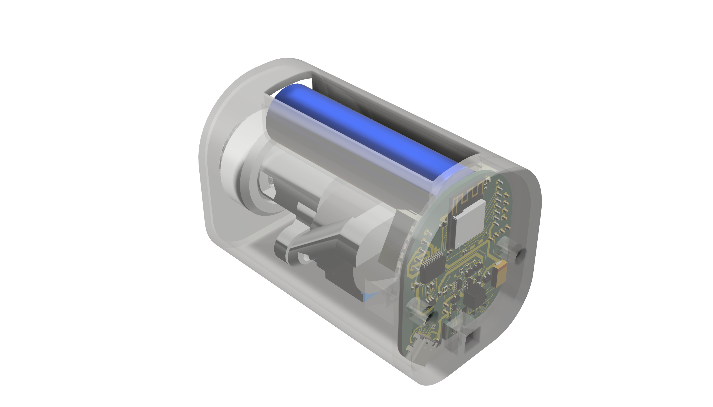

# OpenTRV-ESP

An open-source and open-hardware thermostatic radiator valve based on the ESP32C6 and the 28BYJ-48 stepper motor.

The design phase is [ongoing and documented](documentation/design_rationale.md).

## License

All the software source code is available under the [MIT license](https://choosealicense.com/licenses/mit/) while the hardware design files and derivatives are available under the [CERN Open Hardware Licence Version 2 - Permissive](LICENSE.md).

## Credits

Inspired by https://github.com/fabianmuehlberger/OpenValve.