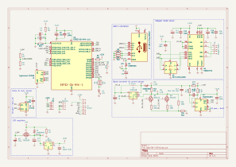

# OpenTRV-ESP design rationale

Design choices, tradeoffs and alternatives are described in this document. It reflects the current status of the project and should be the basis to improve it.

## Hardware

This section discusses particular aspects of the hardware used beside the controller.

### Stepper motor

Small linear actuators are hard to source in small quantities for DIY. For instance, the 25BYJ412L motor is a very good fit but only sourcable from its manufacturer. A quote for 5 units shipped to Europe was around $12 a piece. This project took a different way by trying to adapt cheap and widely available rotary stepper motors into valve actuators.

The selected stepper is the 28BYJ-48 5V, which is a simple unipolar stepper motor. It has a 64:1 reduction gear box and a modest torque. The motor can be turned into a bipolar motor with [a simple modification](https://ardufocus.com/howto/28byj-48-bipolar-hw-mod/). This increases the torque and makes it compatible with bipolar stepper drivers. The torque can also be increased by increasing the operating voltage at the expense of higher heat generation. The 5V model is rated for continuous 5V use, but given its intermittent use within OpenTRV-ESP, operating it with a higher voltage seems acceptable. We tested it up to 12V.

[This repository](https://github.com/mgesteiro/steppers) contains a lot of information on this motor.

A 3D-printed assembly located in the `hardware` directory turns the motor into a linear actuator.

### Supported valves

We currently support valves with M30x1.5mm threads. The current prototype assembly includes a threaded 3D-printed knob to install the OpenTRV-ESP but the later version should include a metal nut into the 3D-printed assembly for durability.

## Battery

The OpenTRV-ESP uses a 18650 battery, usually delivering more than 3000mAh at 3.6v. These batteries require a dedicated charger but have a very high power density. A first complete prototype will establish whether the battery could be reduced to a smaller form factor and capacity.

## Principles

This section discusses ideas and concepts that encompass both hardware and software aspect.

### Motor homing

The OpenTRV-ESP does not use an endstop to find the initial position of the motor. Instead, current sensing is used to determine when the stepper motor is skipping steps when reaching one end of the axis. It can also detect when it is skipping steps when actuating the valve. Alternative designs with endstops should be considered at later stages.

### Valve calibration

The OpenTRV-ESP is calibrated based on two manual measurements, first the distance from the bottom of the threaded assembly to the tip of the valve when fully open, and the valve length. Further experiments could leverage current sensing to detect when the actuator is reaching the valve and when the valve is fully closed as the motor skips. However, inducing motor skips risks blocking the 3D-printed assembly. However, sensing the start of the valve could reduce the required manual measurements to one. Early testing revealed that the current fluctuations in the motor could be sufficient to detect all these changes.

## Controller module

This section discusses the implementation of the controller module.

### Schematic

When possible, the number of different components is kept to a minimal to reduce the manufacturing cost.

#### ESP32C6

The selected microcontroller is the ESP32C6 and its [ESP32-C6-MINI-1 module](https://www.espressif.com/sites/default/files/documentation/esp32-c6-mini-1_mini-1u_datasheet_en.pdf). It embeds Wi-Fi 6, Bluetooth 5, Zigbee 3.0 and Thread 1.3, making it future proof for integrating it in many types of networks. Its claimed low power consumption should be adequate to battery use. It also embeds a Ultra-Low Power RISC cpu that can run during deep sleep and access IOs 0 to 7.

#### USB C

The ESP32C6 has dedicated D+/D- pins to directly interface with USB hosts.

#### +3.3V

The [HT7833](https://www.holtek.com/webapi/116711/HT78xxv150.pdf) LDO regulator is used to stabilize the +3.3V operating voltage. It has a very low quiescient current of 4µA, but requires a quite large output capacitor to remain stable under sudden load, e.g. using Wi-Fi, [as found out by a Reddit user](https://www.reddit.com/r/esp32/comments/16jz2fm/voltage_regulator_stability_comparison_with/). The regulator is fed from a load-sharing circuit using the battery or the USB cable when available. It is expected that during the last portion of the battery capacity, the +3.3V voltage will drop. However, it should still be within the specifications of all devices it supplies. The ESP can sense the battery voltage through a voltage divider and alert the user to charge the battery.

#### Motor operating voltage

The [TLV61408](https://www.ti.com/lit/ds/symlink/tlv61048.pdf?ts=1737279991080&ref_url=https%253A%252F%252Fwww.ti.com%252Fproduct%252FTLV61048) boost converter supplies the motor with selectable 5V, 9V and 12V levels. The inductor has been sized such that up to 750mA at 12V can be delivered to the motor, even with a low battery voltage.
Voltage levels can be selected by enabling two MOSFETs.

#### Current sensing

The [INA219](https://www.ti.com/lit/ds/symlink/ina219.pdf) senses the current going to the motor and provides readings over I2C, to minimise the number of pins required on the ESP for this feature. It includes the recommended filtering stage at its differential inputs to attenuate the potential artifacts introduced by the 1MHz switching frequency of the TLV61408, as the INA219 samples values at 500kHz.

#### Motor driver

The [TB6612FNG](https://cdn.sparkfun.com/datasheets/Robotics/TB6612FNG.pdf) driver is operating the motor. It is said to be more efficient than the L298N and also has a more easily integrable form factor. PWM signals can be supplied to control the effective power delivered to the motor but we chose to change the supplied voltage directly as the ESP32 ULP has no support for PWM, forbidding the use of the motor during deep sleep.

An inverter is used to reduce the number of required pins to two.

DRV8835 is another popular driver but requires PWM.

#### Temperature sensor

The [SHT40](https://sensirion.com/media/documents/33FD6951/662A593A/HT_DS_Datasheet_SHT4x.pdf) I2C sensor enables the OpenTRV-ESP to measure the temperature in order to operate the valve correctly.

#### Headers

The I2C bus is also available on a pin header, as well as an SPI header compatible with Waveshare e-ink displays. The remaining two unused pins are available on a separate pin header as well such that buttons could be added.

## PCB

The PCB is a 4-layer 1.6mm board fitting the back of the OpenTRV-ESP. The ESP is at the top center while the different power stages are on the right-hand side. The temperature sensor is at the bottom left-hand side and cuts in the PCB guard it from heat generated in these stages. The USB connector is at the bottom center facing down. Two M2.5 holes are present to mount the board to the 3D-printed assembly.

## Software

This section discusses the software implementation of the OpenTRV-ESP. This section will grow when the first prototype is produced and tested.